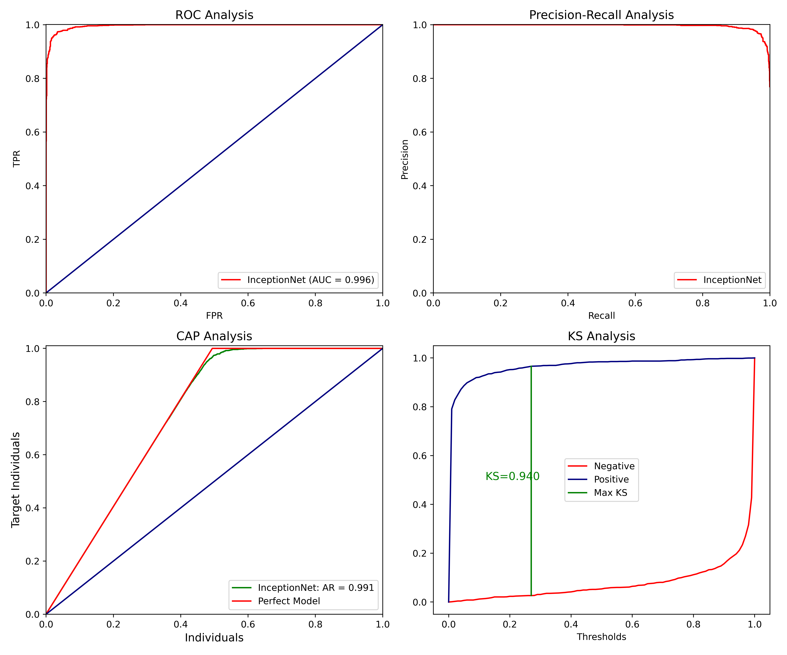

## MARS ROVER CLASSIFICATION

This repository gathers all codes concerned with the competition **Rover Classification** by **AIcrowd**.

Someone has mishandled the labeling of two Mars rover projects — Curiosity and Perseverance — we must classify them correctly.

In order to solve this challenge, I applied **transfer learning** using InceptionNetV3 with a custom top layer:

+ Dense Layer with 1,024 neurons and ReLU activation function;
+ Desen Layer with 1 neuron and sigmoid activation function, where probability assignment takes place.

First, only the top layers' weigths are learned and then the training is finished with a short fine tuning where all wegihts in the entire network are updated.

The results achieved in the validation set are shown below:

+ Target Metrics:

<div>
<table border="1" class="dataframe">
  <thead>
    <tr style="text-align: right;">
      <th>Accuracy</th>
      <th>Recall</th>
      <th>Precision</th>
      <th>F1-Score</th>
      <th>AUC-ROC</th>
    </tr>
  </thead>
  <tbody>
    <tr>
      <td>0.9655</td>
      <td>0.9464</td>
      <td>0.9832</td>
      <td>0.9644</td>
      <td>0.9957</td>
    </tr>
  </tbody>
</table>
</div>


+ Visualizations:




_______


For the training and prediction pipelines, the following command must be executed in a terminal:


```python
python main.py [--epochs INT] [--batch_size INT] [--num_neurons INT] [--learning_rate FLOAT]
```


After the execution is completed, the final csv file to be submitted to AIcrowd will be stored in `output/submission.csv`.
